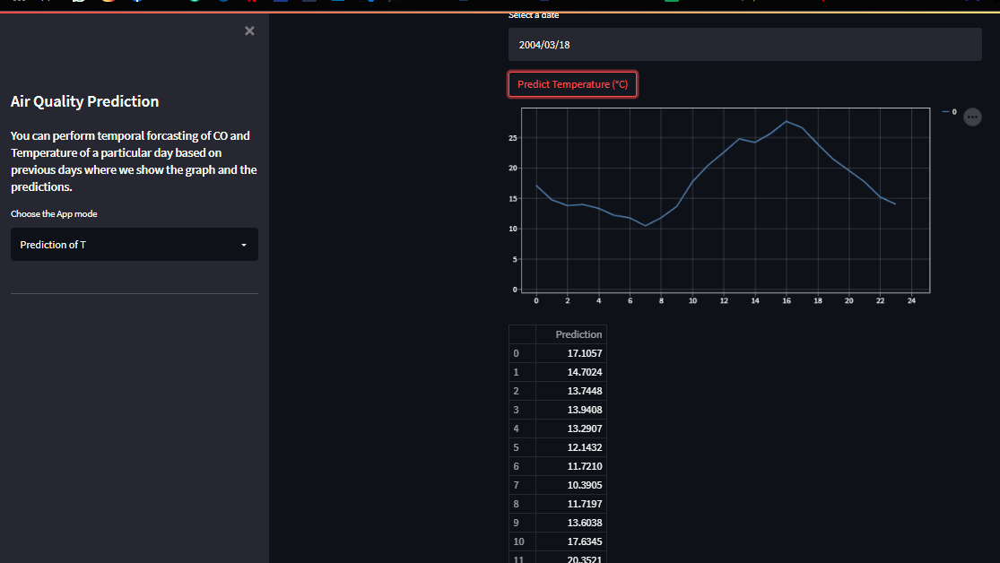

#Team Renegades

## Blue Sky Under
- A web app which takes a date as input from the user and uses historical forecasting to predict and plot CO density(mg/m^3) and Temperature(C) of that day over 24 hours.
- Gives you a line plot as well as a table of values for a specific day's prediction
- Used various techniques of time series forecasting in the model .
- Used streamlit to create the frontend and hosted it on Heroku.

## Front-End Snap

## Dependencies

The python version used in this project is 3.9.x.
* Python Libraries used in project:
    1. streamlit 
    2. darts
    3. numpy
    4. datetime
    5. pickle
    6. pandas
    7. matplotlib
  

## Executing program

After installing all the dependencies, clone the repository into your local drive and then execute the App.py file and the web app will be shown on your local device.

Also we have hosted the web app, you can find it [here](https://blueskyunder.herokuapp.com/)

## Contributors ✨

<!-- ALL-CONTRIBUTORS-LIST:START - Do not remove or modify this section -->
<!-- prettier-ignore-start -->
<!-- markdownlint-disable -->
<table>
  <tr>
    <td align="center"><a href="https://github.com/sameersahu473"> <b>Sameer Ranjan Sahu</b></a> 💻</td>
    <td align="center"><a href="https://github.com/Ankitasareen"> <b>Ankita Sareen</b></a> 💻</td>
    <td align="center"><a href="https://github.com/ahananupam33"> <b>Ahan Anupam</b></a> 💻</td>
  </tr>
</table>

<!-- markdownlint-enable -->
<!-- prettier-ignore-end -->
<!-- ALL-CONTRIBUTORS-LIST:END -->

This project follows the [all-contributors](https://github.com/all-contributors/all-contributors) specification. Contributions of any kind welcome!

## Acknowledgments

* [Stack Overflow](https://stackoverflow.com)
* [Medium Articles](https://medium.com/)
* [You-Tube](https://youtube.com)
* [Streamlit](https://streamlit.io/)
* [Unit8co](https://unit8co.github.io/darts/)

